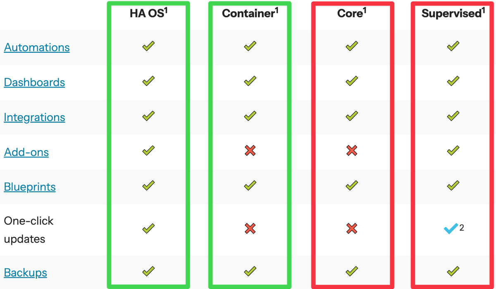
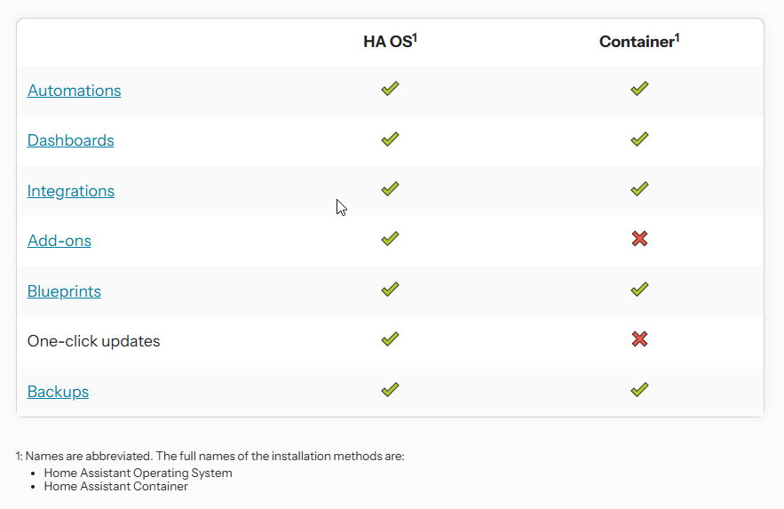
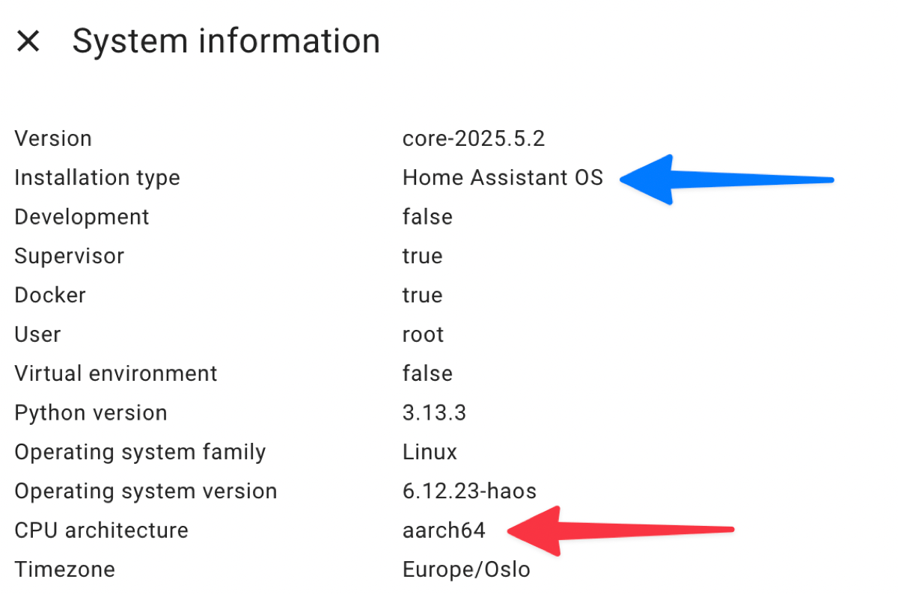
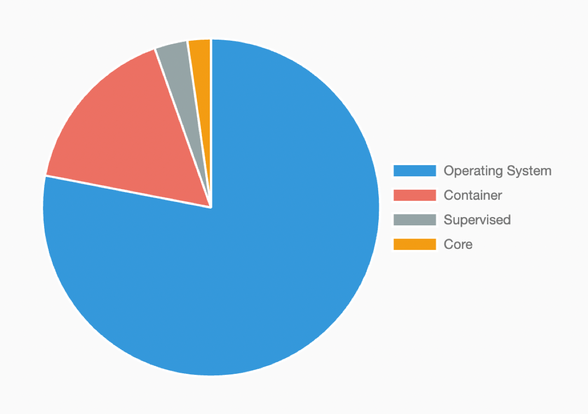

# 🏠 Home Assistant Deprecating Core and Supervised Installation Methods, and 32-bit Systems 🚫

---

## 📢 Important Announcement from Home Assistant - May 22, 2025

Home Assistant is planning a big change! Starting with the **2025.12** release, support and updates will **end** for some older installation methods and CPU architectures.

---

## ❌ What’s Being Deprecated?



### Installation Methods
- **Home Assistant Core** (Python environment)
- **Home Assistant Supervised** (Supervisor on your own OS)

### CPU Architectures
- **i386** (32-bit x86)
- **armhf** (32-bit ARM, e.g., Raspberry Pi 1)
- **armv7** (32-bit ARM, e.g., Raspberry Pi 2)

## ✍️ Blog URL
- [Home Assistant Blog Post (May 22, 2025)](https://www.home-assistant.io/blog/2025/05/22/deprecating-core-and-supervised-installation-methods-and-32-bit-systems/)

## 📚 Architecture Discussions

- [Drop support for the Home Assistant Core installation method](https://github.com/home-assistant/architecture/discussions/1197)
- [Drop support for the Home Assistant Supervised installation method](https://github.com/home-assistant/architecture/discussions/1198)
- [Drop support for the armhf architecture](https://github.com/home-assistant/architecture/discussions/1199)
- [Drop support for the i386 architecture](https://github.com/home-assistant/architecture/discussions/1200)

---

## 🗓️ Timeline

| Date       | Event                                    |
|------------|------------------------------------------|
| June 2025  | ⚠️ Deprecation warnings start             |
| Dec 2025   | ❌ No more support, updates, or bug fixes |

---

## ✅ Recommended Alternatives

- **Home Assistant OS**  
  An all-in-one solution with full features, add-ons, and easiest setup.  
  Ideal if you want a hassle-free experience!

  🏠⚙️ [Home Assistant Installation Guide](https://www.home-assistant.io/installation/) 🚀🔧

- **Home Assistant Container**  
  A Docker-based installation for users who want more flexibility and control. Home Assistant Container installations don’t have access to add-ons.

  # 🏠⚙️ Home Assistant Container Guide 🚀🔧
```bash
# Create compose file
nano compose.yaml

services:
  homeassistant:
    container_name: homeassistant
    hostname: homeassistant
    image: homeassistant/home-assistant:latest
    environment:
      - TZ=Asia/Kolkata # get your Time Zone from - https://en.wikipedia.org/wiki/List_of_tz_database_time_zones
    volumes:
      - ./config/home-assistant:/config #to store data locally.
    restart: unless-stopped
    privileged: true
    ports:
      - '8123:8123'

# Run homeassistant stack
docker compose up -d
```




---

## 🧐 How to Check If You're Affected

1. Open Home Assistant UI  
2. Go to **Settings → System → Repairs → System Information**  
3. Look for:
   - **Installation Type** (Core, Supervised, OS, Container)  
   - **CPU Architecture** (e.g., armv7, aarch64, x86_64)

If your setup uses Core or Supervised on 32-bit architectures, you will need to migrate.


---

## 🔄 Migration Guide

1. **Create a backup** of your current Home Assistant configuration.  
2. **Set up a new instance** using either Home Assistant OS or Container.  
3. **Restore your backup** to transfer all your settings and data.  

> Migration supports architecture changes (for example, moving from 32-bit ARM to 64-bit ARM).

---

## 💬 Why This Change?

- 📉 **Very low usage** of Core (2.5%), Supervised (3.3%), and 32-bit systems (<1%)  
- 🛠️ **High maintenance costs** that no longer justify ongoing support  
- 🚀 Focus on **future-proof, stable, and secure** systems for all users


---

## ❓ FAQ

**Q: Can I still use Core or Supervised?**  
A: Yes, but after December 2025, they will no longer receive updates or bug fixes, which may impact security and compatibility.

**Q: Will my add-ons and integrations still work after migrating?**  
A: Most add-ons and integrations work perfectly on Home Assistant OS and Container installations.

**Q: What if I’m running on unsupported 32-bit hardware?**  
A: It’s recommended to upgrade your hardware to a supported 64-bit platform for continued updates and support.

---

## 📚 Additional Resources

- [Home Assistant Developer Docs](https://developers.home-assistant.io/)
- [Community Forums](https://community.home-assistant.io/)
- [Website](https://www.home-assistant.io/)
- [Blog](https://www.home-assistant.io/blog/)

---

### 💼 Connect with me 👇👇 😊

- 🔥 [**Youtube**](https://www.youtube.com/@DevOpsinAction?sub_confirmation=1)
- ✍ [**Blog**](https://ibraransari.blogspot.com/)
- 💼 [**LinkedIn**](https://www.linkedin.com/in/ansariibrar/)
- 👨‍💻 [**Github**](https://github.com/meibraransari?tab=repositories)
- 💬 [**Telegram**](https://t.me/DevOpsinActionTelegram)
- 🐳 [**Docker**](https://hub.docker.com/u/ibraransaridocker)

# Hit the Star! ⭐
***If you are planning to use this repo for learning, please hit the star. Thanks!***